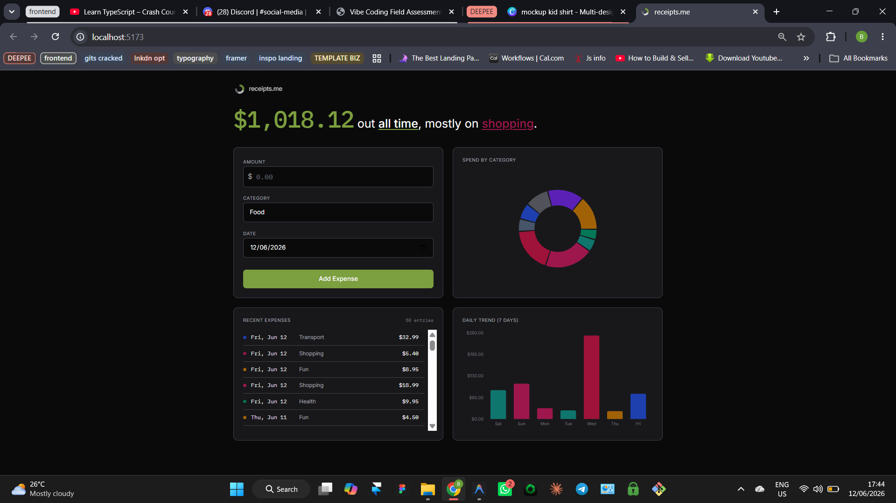

# Tinker Log — Seeding 50 Expenses into the 2×2 Grid

We seeded 50 random expenses spanning 14 days across all 9 categories to stress-test the restructured dashboard layout — the 2×2 card grid, the sentence header, and the hybrid scroll strategy inside individual cards.

---

## The original code

The dashboard uses a 2×2 responsive grid at desktop (`lg:grid-cols-2`) with four cards: ExpenseForm, DonutCard, ListCard, and BarCard. Each card sets a `min-h-[300px]` floor via `flex flex-col` but imposes no upper limit on height. The list card uses `max-h-[260px] overflow-y-auto` for internal scroll — it is the only card with a vertical clamp.

```tsx
// src/App.tsx:96 — the 2×2 grid, single column on mobile
<div className="grid grid-cols-1 lg:grid-cols-2 gap-6">
  <ExpenseForm onAdd={handleAdd} />
  <DonutCard filtered={filtered} hasData={hasData} />
  <ListCard ... />
  <BarCard filtered={filtered} hasData={hasData} />
</div>
```

```tsx
// src/components/ListCard.tsx:42-44 — internal scroll cap inside the list card
<div className="h-full max-h-[260px] overflow-y-auto -mr-2 pr-2">
  <ul className="divide-y divide-bg-border">
```

```tsx
// src/components/DonutCard.tsx:51-52 — chart area with min-height, no max
<div className="flex-1 min-h-[240px] flex items-center justify-center">
```

```tsx
// src/App.tsx:29 — the seed fires once when localStorage is empty
useEffect(() => {
  if (expenses.length === 0) {
    setExpenses(seedExpenses)
  }
  setHydrated(true)
}, [])
```

The seed script (`src/seed.ts`) generates 50 expenses with amounts ranging from $3.49 to $125.00, randomly assigned across all 9 categories, and spread across a 14-day window so some fall inside "this week" and others fall outside.

---

## The experiment

We would test the layout in two states:

1. **Default view ("this week")** — roughly 19 of the 50 expenses fall within the current Monday–Sunday window. The donut chart should render slices for all categories with data. The bar chart should show colored bars per day with the dominant category's hue. The list card should scroll internally, not push the page.

2. **All-time view** — switching the timeframe dropdown to "All Time" loads all 50 expenses. The donut gets denser. The bar chart's 7-day window stays at 7 bars but the amounts shift per day. The list card should still scroll internally at `max-h-[260px]` without extending the card height beyond the grid row.

The desktop viewport is 1440×900. The full page (CornerMark + sentence + 2×2 grid) should fit without page-level vertical scroll — the list handles overflow internally.



---

## Prediction

My prediction was that the dashboard would handle 50 expenses without any form of overlapping. The 2×2 grid cards have `min-h-[300px]` floors and flex-column layouts, which should keep row heights aligned even when one card's content is sparse. The list card's `max-h-[260px]` internal scroll would prevent the page from extending — the scrollbar would appear inside the list card rather than pushing the page footer down.

The donut chart with 9 possible categories would render distinct, non-overlapping slices at `innerRadius={60}` / `outerRadius={100}` with `paddingAngle={2}` keeping adjacent slices visually separated. The bar chart's `maxBarSize={40}` would prevent individual bars from growing too wide in a half-width card.

The sentence header at full-width would read as a headline with the amount at `text-6xl` (60px) in sage Plex Mono.

At mobile (375px), the single-column stack would push the list card last — it would dominate the vertical space and the user would scroll the page, not the card.

---

## Result

The prediction was correct.

The dashboard handled all 50 expenses without any overlapping elements. The 2×2 grid maintained aligned row heights. The donut chart rendered each category in its assigned color — food (rose), transport (cobalt), housing (teal), bills (slate), health (emerald), shopping (pink), fun (amber), data (violet), other (zinc) — with no two slices sharing an ambiguous hue. The bar chart colored each day's bar by its dominant category. Zero-spending days showed as muted gray rest-bars (`#27272A`).

The list card scrolled internally at 19 entries ("this week") and 50 entries ("all time") without pushing the page. The `max-h-[260px]` clamp worked exactly as designed — roughly 5-6 rows visible, the rest behind a scroll.

The sentence header rendered the tied-state variant — "spread evenly" — because with 50 random expenses across 9 categories, the top and second categories were within the 5% threshold.

No error. No overflow. No warning. The page fit in the viewport at 1440×900 without page-level scroll.

---

## What this taught me

A layout composed of `min-h` floors with exactly one overflow clamp (the list card) can absorb arbitrary data without breaking. The design's stability comes from three decisions made independently of data volume:

- **Grid alignment via `min-h` instead of fixed heights.** Cards don't fight each other for vertical space; they agree on a minimum and grow together. The `flex flex-col` wrapper distributes internal content vertically so charts fill available space rather than floating at the top.

- **Exactly one card has a scroll, and it is the one with unbounded content.** The list card is the only component whose vertical size depends on data count. By capping it at `max-h-[260px]` and adding `overflow-y-auto`, the grid row stays stable — the page never extends beyond the viewport. The donut and bar charts have fixed conceptual size (one circle, 7 bars) so they need no clamp.

- **Sparse-data states prevent visual collapse.** When data is empty, each card renders a quiet `text-text-faint` placeholder instead of a 0-height void. This keeps the grid visually filled even before the user adds data — the skeleton is complete on first load.

The one open question: at mobile, the single-column stack pushes the list card to the bottom. With 50 entries and no page-level clamp on mobile, the list card can dominate the viewport. A design decision for later: should mobile use a page-level `max-height: 100dvh` with the entire dashboard scrolling as one unit, or should each card handle its own overflow independently? The current answer — let mobile scroll the page — is simple and functional. A unified viewport clamp would be a refinement, not a fix.
